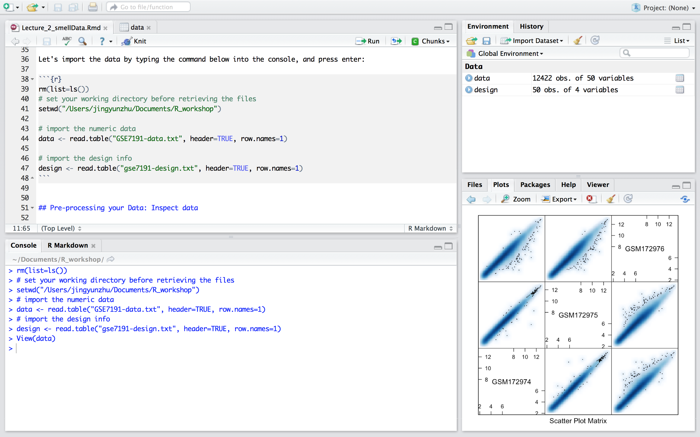
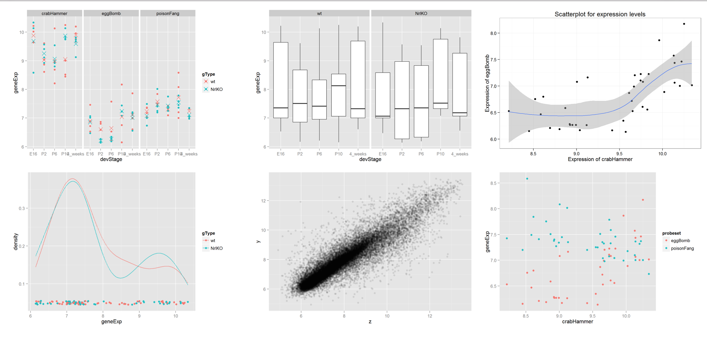
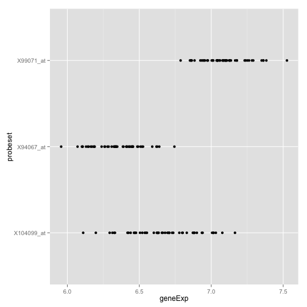
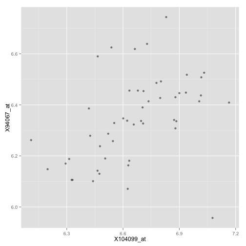
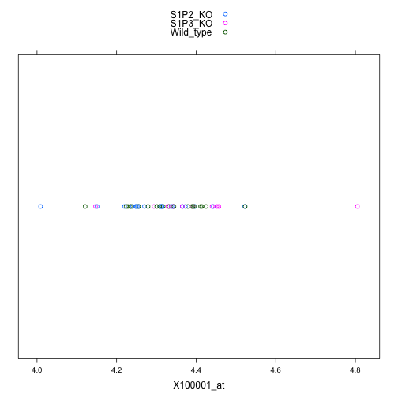
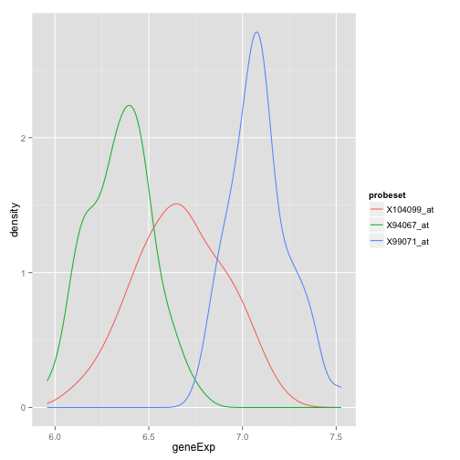
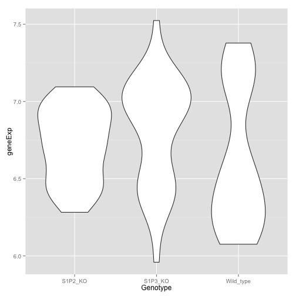
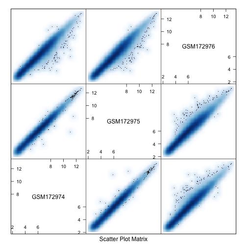
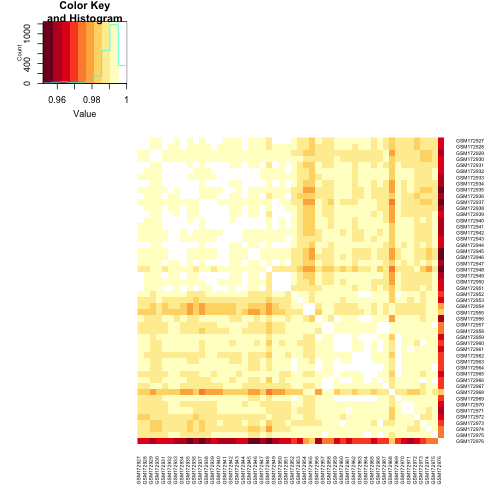

# Review of Lecture 1

## Recapitulation of Rstudio features: layout and utility




## Create a new project
* Demo of steps
* Console utility 
* Save your work (scripts & R objects) for reproducibility

# Pre-processing data: import and inspect data
## Pre-processing your Data: Importing data

* The raw data usually consists of the numeric data and a description for the experimental design pertaining to the numeric data. 

* Please download the data and description files from:
    * Data: https://github.com/evayap/bccrc_rworkshop_series/tree/master/lecture2/data/GSE7191-data.txt
    * Description of data: https://github.com/evayap/bccrc_rworkshop_series/tree/master/lecture2/data/GSE7191-design.txt

* Let's import the data by typing the command below into the console, and press enter:


```r
# set your working directory before retrieving the files
# setwd("/Users/jingyunzhu/Documents/R_workshop")

# import the numeric data
data <- read.table("data/GSE7191-data.txt", header=TRUE, row.names=1)
# import the design info
design <- read.table("data/gse7191-design.txt", header=TRUE, row.names=1)
```


## Pre-processing your Data: Inspect data

* ```read.table()``` renders the imported data in a ```data.frame```
* To view the data.frame instances, you can click on the ```data``` and ```design``` icon inside the Environment panel on your RHS.

```r
View(data)
View(design)
```

* What's their dimension size? 

```r
dim(data) # try ncol(), or nrow()
```

```
## [1] 12422    50
```

```r
dim(design)
```

```
## [1] 50  4
```

## Take a look at the structure of `data` 


```r
str(data)
```

```
'data.frame':	12422 obs. of  50 variables:
 $ GSM172927: num  4.28 6.71 5.3 5.94 6.55 ...
 $ GSM172928: num  4.12 6.78 5.24 5.82 6.61 ...
 $ GSM172929: num  4.52 6.49 4.93 5.99 6.57 ...
 $ GSM172930: num  4.22 6.45 4.87 5.92 6.51 ...
 $ GSM172931: num  4.39 6.68 5.23 6.11 6.59 ...
 $ GSM172932: num  4.23 6.56 5.01 5.95 6.85 ...
 $ GSM172933: num  4.33 6.67 5.13 6.05 6.86 ...
 $ GSM172934: num  4.3 6.48 5.21 5.91 6.64 ...
```

## Take a look at the structure of `design` 


```r
str(design)
```

```
'data.frame':  50 obs. of  4 variables:
 $ DateRun    : Factor w/ 8 levels "01/16/04","03/11/04",..: 5 5 5 5 ...
 $ Genotype   : Factor w/ 3 levels "S1P2_KO","S1P3_KO",..: 3 3 3 3 3 ...
 $ BrainRegion: Factor w/ 2 levels "hippocampus",..: 2 2 2 2 2 2 2 2 ...
 $ Sex        : Factor w/ 2 levels "female","male": 2 2 2 2 2 1 1 1  ...
 ```

## How are the samples assigned based on the experimental design?

* Based on each of the categorical factors in the `design`:


```r
summary(design)
```

```
##      DateRun       Genotype       BrainRegion     Sex    
##  08/14/03:8   S1P2_KO  :20   hippocampus:25   female:26  
##  08/21/03:8   S1P3_KO  :10   neocortex  :25   male  :24  
##  01/16/04:7   Wild_type:20                               
##  09/11/03:7                                              
##  10/23/03:7                                              
##  12/18/03:5                                              
##  (Other) :8
```


## Sample distribution based on >1 categorical factors

```r
with(design, table(Genotype, BrainRegion, Sex))
```

```
## , , Sex = female
## 
##            BrainRegion
## Genotype    hippocampus neocortex
##   S1P2_KO             5         5
##   S1P3_KO             3         3
##   Wild_type           5         5
## 
## , , Sex = male
## 
##            BrainRegion
## Genotype    hippocampus neocortex
##   S1P2_KO             5         5
##   S1P3_KO             2         2
##   Wild_type           5         5
```

Alternatively, you could try `table()`


## How about the distribution of the expression level in each sample?

* `summary()` can integrate the results that are outputted from min(), max(), range(), fivenum(), mean(), median(), quantile()

```r
summary(data)
```


```
##    GSM172927          GSM172928          GSM172929       
##  "Min.   : 2.434  " "Min.   : 2.474  " "Min.   : 2.378  "
##  "1st Qu.: 4.508  " "1st Qu.: 4.445  " "1st Qu.: 4.546  "
##  "Median : 5.995  " "Median : 5.931  " "Median : 5.961  "
##  "Mean   : 6.020  " "Mean   : 5.970  " "Mean   : 5.986  "
##  "3rd Qu.: 7.372  " "3rd Qu.: 7.309  " "3rd Qu.: 7.284  "
##  "Max.   :12.710  " "Max.   :12.710  " "Max.   :12.670  "
##    GSM172930          GSM172931       
##  "Min.   : 2.345  " "Min.   : 2.372  "
##  "1st Qu.: 4.538  " "1st Qu.: 4.525  "
##  "Median : 5.976  " "Median : 6.013  "
##  "Mean   : 5.990  " "Mean   : 6.020  "
##  "3rd Qu.: 7.297  " "3rd Qu.: 7.356  "
##  "Max.   :12.740  " "Max.   :12.650  "
```

## Is there any NA value?

* NA values can impede your downstream data analysis
* NA value can also result in analysis errors without triggering warnings message.

```r
length(which(is.na(data)==TRUE))
```

```
## [1] 0
```


# Plot your data: Stripplot, Scatter plot, Density plot, Box plot, Violin plot


## Plotting your Data: introduction to ggplot2


* Let's install it

```r
#install.packages('ggplot2')  
library(ggplot2)
```


* Why use ggplot2? 
    * Elaborated rendering of color (gradient), and automatic legends, matching publishing standard even with default setting
    * Capable of integrating complexed/diverse dimensions of data onto one single plot
    * Each plot is stored as an object, convenient for further modification, improving code reusability
    * Linear syntax, more intuitive for the graph logics
    * For more details, read [here](https://github.com/hadley/ggplot2/wiki/Why-use-ggplot2)


## Plotting your Data: How to decode the ggplot2 syntex?

* gg = Grammar of Graphics

* The complexed graph is composed by **layers** that superimpose one by one, with each layer corresponding to data, coordinates, statistical representation, and etc.
    * Example:
  ```
  (p <- ggplot(nDat, aes(crabHammer, geneExp, color = probeset)) + geom_point() + stat_smooth(se = F, aes(group = 1)))
  ```
* The data (entries) can be mapped to **Aesthetics** elements, such as by their position on user-defined x- and y- axis, or to color, and linetypes.   
* **Geometries** elements are used to plot the graphs

 

## Figures plotted via ggplot2




## Plotting your Data: draw the data of some probes via stripplot (ggplot2)

Recall that:


* There are 50 samples with each containing 12422 probe expression in `data`
* There are 50 samples with each containing 4 categorical description in `design`


(1) Let's shrink the `data` by picking only three probes, 

* i.e. "104099_at", "99071_at", "94067_at"
    

```r
sProbes <- c("104099_at", "99071_at", "94067_at")
sData <- data[sProbes, ]
str(sData, max.level=0)
```

```
## 'data.frame':	3 obs. of  50 variables:
```


## Plotting your Data: draw the data of some probes via stripplot (ggplot2)

(2) Merge the `design` and `sData` into one tall `data.frame`, so the expression data of the 3 probes could be appended after each row in `design`, 


```r
t.sData <- data.frame(t(sData))

# Before merging, make sure the sample order matches
identical(rownames(t.sData), rownames(design))
```

```
## [1] TRUE
```

```r
annotatedDat <- data.frame(design, t.sData)
```


```r
str(annotatedDat)
```

```
'data.frame':  50 obs. of  7 variables:
 $ DateRun    : Factor w/ 8 levels "01/16/04","03/11/04",..: 5 5 5 5 ...
 $ Genotype   : Factor w/ 3 levels "S1P2_KO","S1P3_KO",..: 3 3 3 3 3 ...
 $ BrainRegion: Factor w/ 2 levels "hippocampus",..: 2 2 2 2 2 2 2 2 ...
 $ Sex        : Factor w/ 2 levels "female","male": 2 2 2 2 2 1 1 1  ...
 $ X104099_at : num  6.29 6.2 6.46 6.55 6.31 ...
 $ X99071_at  : num  7.28 7.26 7.25 7.35 7.11 ...
 $ X94067_at  : num  6.17 6.15 6.14 6.33 6.19 ...
```

Notice the "X" added in front of all the probe names.


## Plotting your Data: draw the data of some probes via stripplot (ggplot2)

(3) Reshape `annotatedDat` into a taller `data.frame`:

* Only 1 probe expression is appended after each row
* Introduce a new categorical descriptor, `probeset`, to label what probe this expression is for
    

```r
colnames(annotatedDat)
```

```
## [1] "DateRun"     "Genotype"    "BrainRegion" "Sex"         "X104099_at" 
## [6] "X99071_at"   "X94067_at"
```

```r
tall.annoDat <-
  with(annotatedDat,
       data.frame(DateRun, Genotype, BrainRegion, Sex,
                  probeset = factor(rep(
                  c("X104099_at", "X99071_at", "X94067_at" ), 
                  each = nrow(annotatedDat))),
                  geneExp = c(X104099_at, X99071_at, X94067_at)))
```


## Plotting your Data: draw the data of some probes via stripplot (ggplot2)


```r
str(tall.annoDat)
```

```
'data.frame':  150 obs. of  6 variables:
 $ DateRun    : Factor w/ 8 levels "01/16/04","03/11/04",..: ...
 $ Genotype   : Factor w/ 3 levels "S1P2_KO","S1P3_KO",..: 3 ...
 $ BrainRegion: Factor w/ 2 levels "hippocampus",..: 2 2 2 2 ...
 $ Sex        : Factor w/ 2 levels "female","male": 2 2 2 2 2 ...
 $ probeset   : Factor w/ 3 levels "X104099_at","X94067_at",..: ...
 $ geneExp    : num  6.29 6.2 6.46 6.55 6.31 ...


## Stripplot: gene expression over 1 dimension, e.g. Probeset


```r
(p <- ggplot(tall.annoDat, aes(geneExp, probeset)) + 
   geom_point())
```

 


## Stripplot: gene expression over 2 dimension, e.g. Probeset + Genotype


```r
(p <- ggplot(tall.annoDat, aes(Genotype, geneExp)) + 
   geom_point()+aes(color = probeset))
```

 


## What do we mean by ggplot2 has pretty picture?




## Plotting your Data: Scatterplot, X104099_at vs. X94067_at


```r
p <- ggplot(annotatedDat, aes(x = X104099_at, y = X94067_at))
(p  <- p + geom_point(alpha = 0.5))
```

 

## Plotting your Data: Density plot


```r
(p <- ggplot(tall.annoDat, aes(geneExp, color = probeset)) + 
   stat_density(geom = "line", position = "identity"))
```

 

## Plotting your Data: Box plot over Genotype


```r
(p <- ggplot(tall.annoDat, aes(Genotype, geneExp)) + 
   geom_boxplot())
```

 

## Plotting your Data: Violin plot over Genotype


```r
(p <- ggplot(tall.annoDat, aes(Genotype, geneExp)) + 
   geom_violin())
```

 


# Identify outlier sample via heatmap, pairwise correlation plot

## Sample correlation

* Do we expect all the 50 samples to be clustered closely (based on the expression level of the 12422 probes) together? If no, why?

* Different experimental condition, such as treatment
* Heterogeneity of the organisms
    * genotype underlying the organisms
    

```r
levels(design$Genotype)
```

```
## [1] "S1P2_KO"   "S1P3_KO"   "Wild_type"
```
    

* Outlier due to batch effect, technical errors


## Heatmap of sample correlation: Calculate correlation matrix 

* convert `DateRun` column into Date format so as to sort the 50 samples by `DateRun` in the increasing order

```r
annotatedDat$DateRun<-as.Date(annotatedDat$DateRun, format="%m/%d/%y")
annotatedDat <- annotatedDat[order(annotatedDat$DateRun),]
```


* convert gene expression data from `data.frame` into matrix

```r
mData <- as.matrix(data)
```


* construct the correlation matrix

```r
library(RColorBrewer)
cols<-c(rev(brewer.pal(9,"YlOrRd")), "#FFFFFF")
sampleCorrelation <- cor(mData)
```


## Heatmap of sample correlation: Plot heatmap

```r
library(gplots)
heatmap.2(sampleCorrelation, Rowv=NA, Colv=NA, symm=T,trace="none", 
          dendrogram="none", col=cols, cexCol=0.5,cexRow=0.5)
```

 


## Inspecting the correlation heatmap: seemingly an outlier?

Does sample GSM172976 deviate from the other samples? Why?


## Sample correlation

* Do we expect all the 50 samples to be clustered closely (based on the expression level of the 12422 probes) together? If no, why?

* Different experimental condition, such as treatment
* Heterogeneity of the organisms
    * genotype underlying the organisms
    

```r
levels(design$Genotype)
```

```
## [1] "S1P2_KO"   "S1P3_KO"   "Wild_type"
```
    

* **Outlier due to batch effect, technical errors**


## Comparison of samples within the same experimental condition

* Let's inspect it more closely with a pairwise correlation plot 
    * i.e. compare the outlier sample vs the samples in the same experimental condition. 
    
* what's the experimental condition of the outlier?    

```r
design["GSM172976", ]
```

```
##            DateRun Genotype BrainRegion    Sex
## GSM172976 01/16/04  S1P3_KO hippocampus female
```


## Comparison of samples within the same experimental condition

* find the remaining sample in this experimental group:

```r
(outlierIndex <- which(colnames(data)=="GSM172976"))
```

```
## [1] 50
```

```r
(allIndex <- which(design$Genotype=="S1P3_KO" & 
design$BrainRegion == "hippocampus" &
design$Sex == "female"))
```

```
## [1] 48 49 50
```

```r
colnames(data)[allIndex]
```

```
## [1] "GSM172974" "GSM172975" "GSM172976"
```

```r
outlierGroup <- data[,allIndex]
```


## Plot the pairwise correlation of the outlier experimental group

```r
library(lattice)
splom(data.frame(outlierGroup), panel = panel.smoothScatter, raster =TRUE)
```

 


# Credits

## This Workshop Brought to You By...


### Course Developers:
- Alice Zhu
- Eva Yap

### Reference
Much of the code and data were borrowed from the [UBC STAT540 course website](http://stat540-ubc.github.io), which was taught by Dr.Jennifer Bryan, Dr.Gabriela Cohen-Freue and Dr.Paul Pavlidis, and Dr.Sara mostafavi.

### Pizza and Logistics:
- GraSPoDS (especially Eva Yap and Jessica Pilsworth)

### License:
You are free to download, copy and modify this work in accordance with the [Creative Commons Attribution License](http://creativecommons.org/licenses/by/3.0/).


