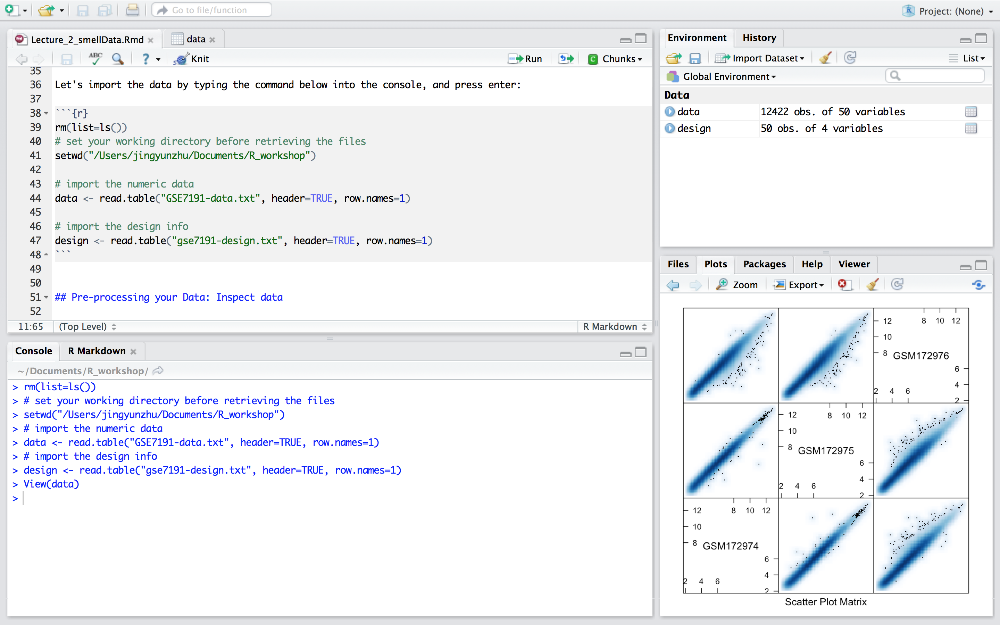
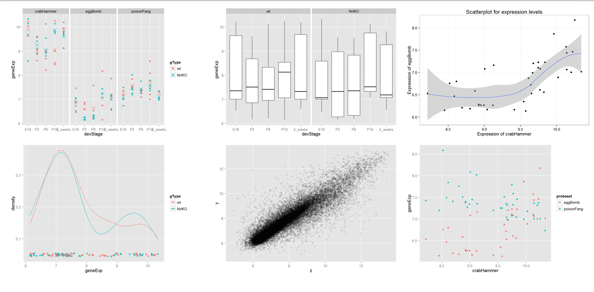
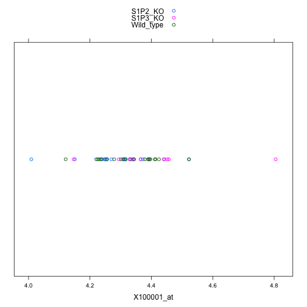

# Review of Lecture 1

## Recapitulation of Rstudio features: layout and utility




## Create a new project
* Demo of steps
* Console utility 
* Save your work (scripts & R objects) for reproducibility

# Pre-processing data: import and inspect data
## Pre-processing your Data: Importing data

* The raw data usually consists of the numeric data and a description for the experimental design pertaining to the numeric data. 

* Please download the data and description files from:
    * Data: TODO(insert link)
    * Description of data: TODO(insert link)

* Let's import the data by typing the command below into the console, and press enter:

```{r}
# set your working directory before retrieving the files
setwd("/Users/jingyunzhu/Documents/R_workshop")

# import the numeric data
data <- read.table("data/GSE7191-data.txt", header=TRUE, row.names=1)
# import the design info
design <- read.table("data/gse7191-design.txt", header=TRUE, row.names=1)
```


## Pre-processing your Data: Inspect data

* ```read.table()``` renders the imported data in a ```data.frame```
* To view the data.frame instances, you can click on the ```data``` and ```design``` icon inside the Environment panel on your RHS.
```{r eval=FALSE}
View(data)
View(design)
```

* What's their dimension size? 
```{r}
dim(data) # try ncol(), or nrow()
dim(design)
```

## Take a look at the structure of `data` 

```{r eval=FALSE}
str(data)
```

```
'data.frame':	12422 obs. of  50 variables:
 $ GSM172927: num  4.28 6.71 5.3 5.94 6.55 ...
 $ GSM172928: num  4.12 6.78 5.24 5.82 6.61 ...
 $ GSM172929: num  4.52 6.49 4.93 5.99 6.57 ...
 $ GSM172930: num  4.22 6.45 4.87 5.92 6.51 ...
 $ GSM172931: num  4.39 6.68 5.23 6.11 6.59 ...
 $ GSM172932: num  4.23 6.56 5.01 5.95 6.85 ...
 $ GSM172933: num  4.33 6.67 5.13 6.05 6.86 ...
 $ GSM172934: num  4.3 6.48 5.21 5.91 6.64 ...
```

## Take a look at the structure of `design` 

```{r}
str(design)
```


## How are the samples assigned based on the experimental design?

* Based on each of the categorical factors in the `design`:

```{r}
summary(design)
```


## Sample distribution based on >1 categorical factors
```{r}
with(design, table(Genotype, BrainRegion, Sex))
```

Alternatively, you could try `table()`


## How about the distribution of the expression level in each sample?

* `summary()` can integrate the results that are outputted from min(), max(), range(), fivenum(), mean(), median(), quantile()
```{r eval=FALSE}
summary(data)
```

```{r echo=FALSE}
summary(data)[, 1:5]
```

## Is there any NA value?

* NA values can impede your downstream data analysis
* NA value can also result in analysis errors without triggering warnings message.
```{r}
length(which(is.na(data)==TRUE))
```


# Plot your data: Stripplot, Scatter plot, Density plot, Box plot, Violin plot


## Plotting your Data: introduction to ggplot2


* Let's install it
```{r message=FALSE}
#install.packages('ggplot2')  
library(ggplot2)
```


* Why use ggplot2? 
    * Elaborated rendering of color (gradient), and automatic legends, matching publishing standard even with default setting
    * Capable of integrating complexed/diverse dimensions of data onto one single plot
    * Each plot is stored as an object, convenient for further modification, improving code reusability
    * Linear syntax, more intuitive for the graph logics
    * For more details, read [here](https://github.com/hadley/ggplot2/wiki/Why-use-ggplot2)


## Plotting your Data: How to decode the ggplot2 syntex?

* gg = Grammar of Graphics

* The complexed graph is composed by **layers** that superimpose one by one, with each layer corresponding to data, coordinates, statistical representation, and etc.
    * Example:
  ```
  (p <- ggplot(nDat, aes(crabHammer, geneExp, color = probeset)) + geom_point() + stat_smooth(se = F, aes(group = 1)))
  ```
* The data (entries) can be mapped to **Aesthetics** elements, such as by their position on user-defined x- and y- axis, or to color, and linetypes.   
* **Geometries** elements are used to plot the graphs

 

## Figures plotted via ggplot2




## Plotting your Data: draw the data of some probes via stripplot (ggplot2)

Recall that:


* There are 50 samples with each containing 12422 probe expression in `data`
* There are 50 samples with each containing 4 categorical description in `design`


(1) Let's shrink the `data` by picking only three probes, 

* i.e. "104099_at", "99071_at", "94067_at"
    
```{r}
sProbes <- c("104099_at", "99071_at", "94067_at")
sData <- data[sProbes, ]
str(sData, max.level=0)
```


## Plotting your Data: draw the data of some probes via stripplot (ggplot2)

(2) Merge the `design` and `sData` into one tall `data.frame`, so the expression data of the 3 probes could be appended after each row in `design`, 

```{r}
t.sData <- data.frame(t(sData))

# Before merging, make sure the sample order matches
identical(rownames(t.sData), rownames(design))
annotatedDat <- data.frame(design, t.sData)
str(annotatedDat)
```

Notice the "X" added in front of all the probe names.


## Plotting your Data: draw the data of some probes via stripplot (ggplot2)

(3) Reshape `annotatedDat` into a taller `data.frame`:

* Only 1 probe expression is appended after each row
* Introduce a new categorical descriptor, `probeset`, to label what probe this expression is for
    
```{r}
colnames(annotatedDat)
tall.annoDat <-
  with(annotatedDat,
       data.frame(DateRun, Genotype, BrainRegion, Sex,
                  probeset = factor(rep(
                  c("X104099_at", "X99071_at", "X94067_at" ), 
                  each = nrow(annotatedDat))),
                  geneExp = c(X104099_at, X99071_at, X94067_at)))
```


## Plotting your Data: draw the data of some probes via stripplot (ggplot2)

```{r}
str(tall.annoDat)
```


## Stripplot: gene expression over 1 dimension, e.g. Probeset

```{r}
(p <- ggplot(tall.annoDat, aes(geneExp, probeset)) + 
   geom_point())
```


## Stripplot: gene expression over 2 dimension, e.g. Probeset + Genotype

```{r}
(p <- ggplot(tall.annoDat, aes(Genotype, geneExp)) + 
   geom_point()+aes(color = probeset))
```


## What do we mean by ggplot2 has pretty picture?




## Plotting your Data: Scatterplot, X104099_at vs. X94067_at

```{r}
p <- ggplot(annotatedDat, aes(x = X104099_at, y = X94067_at))
(p  <- p + geom_point(alpha = 0.5))
```

## Plotting your Data: Density plot

```{r}
(p <- ggplot(tall.annoDat, aes(geneExp, color = probeset)) + 
   stat_density(geom = "line", position = "identity"))
```

## Plotting your Data: Box plot over Genotype

```{r}
(p <- ggplot(tall.annoDat, aes(Genotype, geneExp)) + 
   geom_boxplot())
```

## Plotting your Data: Violin plot over Genotype

```{r}
(p <- ggplot(tall.annoDat, aes(Genotype, geneExp)) + 
   geom_violin())
```


# Identify outlier sample via heatmap, pairwise correlation plot

## Sample correlation

* Do we expect all the 50 samples to be clustered closely (based on the expression level of the 12422 probes) together? If no, why?

* Different experimental condition, such as treatment
* Heterogeneity of the organisms
    * genotype underlying the organisms
    
```{r}
levels(design$Genotype)
```
    

* Outlier due to batch effect, technical errors


## Heatmap of sample correlation: Calculate correlation matrix 

* convert `DateRun` column into Date format so as to sort the 50 samples by `DateRun` in the increasing order
```{r}
annotatedDat$DateRun<-as.Date(annotatedDat$DateRun, format="%m/%d/%y")
annotatedDat <- annotatedDat[order(annotatedDat$DateRun),]
```


* convert gene expression data from `data.frame` into matrix
```{r}
mData <- as.matrix(data)
```


* construct the correlation matrix
```{r}
library(RColorBrewer)
cols<-c(rev(brewer.pal(9,"YlOrRd")), "#FFFFFF")
sampleCorrelation <- cor(mData)
```


## Heatmap of sample correlation: Plot heatmap
```{r message=FALSE}
library(gplots)
heatmap.2(sampleCorrelation, Rowv=NA, Colv=NA, symm=T,trace="none", 
          dendrogram="none", col=cols, cexCol=0.5,cexRow=0.5)
```


## Inspecting the correlation heatmap: seemingly an outlier?

Does sample GSM172976 deviate from the other samples? Why?


## Sample correlation

* Do we expect all the 50 samples to be clustered closely (based on the expression level of the 12422 probes) together? If no, why?

* Different experimental condition, such as treatment
* Heterogeneity of the organisms
    * genotype underlying the organisms
    
```{r}
levels(design$Genotype)
```
    

* **Outlier due to batch effect, technical errors**


## Comparison of samples within the same experimental condition

* Let's inspect it more closely with a pairwise correlation plot 
    * i.e. compare the outlier sample vs the samples in the same experimental condition. 
    
* what's the experimental condition of the outlier?    
```{r}
design["GSM172976", ]
```


## Comparison of samples within the same experimental condition

* find the remaining sample in this experimental group:
```{r}
(outlierIndex <- which(colnames(data)=="GSM172976"))
(allIndex <- which(design$Genotype=="S1P3_KO" & 
design$BrainRegion == "hippocampus" &
design$Sex == "female"))
colnames(data)[allIndex]
outlierGroup <- data[,allIndex]
```


## Plot the pairwise correlation of the outlier experimental group
```{r}
library(lattice)
splom(data.frame(outlierGroup), panel = panel.smoothScatter, raster =TRUE)
```


# Credits

## This Workshop Brought to You By...


### Course Developers:

- Kieran O'Neill
- Eva Yap
- Alice Zhu

### Starting Material:

Much material was reused from [Software Carpentry's Bootcamp workshops](https://github.com/swcarpentry/bc/tree/master/novice/r) and from [Andy Teucher's short R course](https://github.com/ateucher/rcourse_site), both under the terms of the [Creative Commons Attribution License](http://creativecommons.org/licenses/by/3.0/). 

### Reference
Much of the code and data were borrowed from the [UBC STAT540 course website](http://stat540-ubc.github.io), which was taught by Dr.Jennifer Bryan, Dr.Gabriela Cohen-Freue and Dr.Paul Pavlidis, and Dr.Sara mostafavi.

### Pizza and Logistics:

- GraSPoDS (especially Eva Yap and Jessica Pilsworth)

### License:

You are free to download, copy and modify this work in accordance with the [Creative Commons Attribution License](http://creativecommons.org/licenses/by/3.0/).


